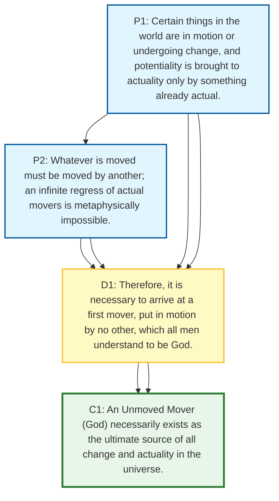

```mermaid
graph TD;
    classDef premise fill:#e1f5fe,stroke:#01579b,stroke-width:2px;
    classDef deduction fill:#fff9c4,stroke:#fbc02d,stroke-width:2px;
    classDef conclusion fill:#e8f5e9,stroke:#2e7d32,stroke-width:3px;

    P1["P1: Certain things in the world are in motion or undergoing change, and potentiality is brought to actuality only by something already actual."];
    class P1 premise;
    P2["P2: Whatever is moved must be moved by another; an infinite regress of actual movers is metaphysically impossible."];
    class P2 premise;
    D1["D1: Therefore, it is necessary to arrive at a first mover, put in motion by no other, which all men understand to be God."];
    class D1 deduction;
    C1["C1: An Unmoved Mover (God) necessarily exists as the ultimate source of all change and actuality in the universe."];
    class C1 conclusion;

    %% Dependencies and Support Edges
    P1 --> P2;
    P1 --> D1;
    P2 --> D1;
    P1 --> D1;
    P2 --> D1;
    D1 --> C1;
    D1 --> C1;
```
